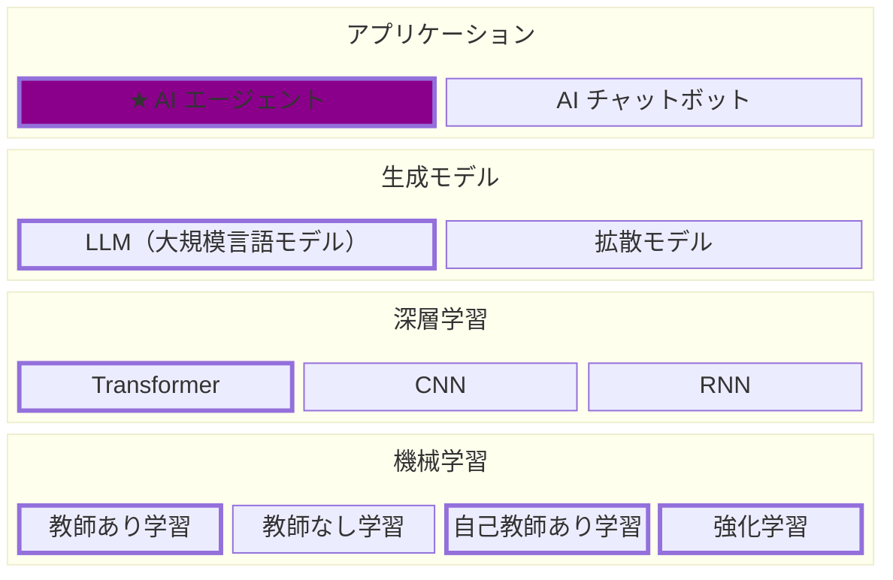

# AI Agent Seminar

AI エージェントの実装を段階的に学ぶための教材リポジトリです。

## 勉強会開催の背景

AI プロジェクトでは、AI を活用した製品・サービスを開発します。そこでは、AI そのものに関する専門知識と、それを動くソフトウェアとして形にする実装スキルの両方を備えた技術者が必要です。この勉強会は、その土台となる知識を体系的に身につける場として開催しています。

## この勉強会の目的

この勉強会の目的は、**AI エージェントを開発するために必要な知識を身につけること**です。LLM の基本的な仕組みを理解したうえで、記憶・RAG・Planning・Tool といった構成要素を自分の手で実装できる状態を目指します。

> **注意:** この勉強会の目的は「AI エージェントや AI ツールを使いこなせるようになること」ではありません。
> 作る側のスキルと使う側のスキルはまったく別のものです。後者を身につけたい場合は、この勉強会とは別の機会が必要になります。

## 学習範囲の位置づけ

AI エージェントは、LLM をはじめとする生成モデルを利用して作られる **アプリケーション** です。そのアプリケーションは、生成モデル・深層学習・機械学習といったコア技術のレイヤーの上に成り立っています。



| レイヤー         | 主な例                                                 | 説明                                                   |
| ---------------- | ------------------------------------------------------ | ------------------------------------------------------ |
| アプリケーション | **AI エージェント**、AI チャットボット                 | 生成モデルを組み込み、ユーザー向けに提供する機能や製品 |
| 生成モデル       | LLM、拡散モデル                                        | テキスト・画像などを生成するモデル                     |
| 深層学習         | Transformer、CNN、RNN                                  | 多層ニューラルネットワークで表現学習を行う手法         |
| 機械学習         | 教師あり学習、教師なし学習、自己教師あり学習、強化学習 | データからパターンを学習し予測・意思決定を行う手法     |

### 下位レイヤーの学習的意義

- **挙動を理解する** — **生成モデル（LLM）** と **深層学習（Transformer）** の知識は、ハルシネーションや出力のばらつきの原因特定と、プロンプト／コンテキスト設計による対策に必要です。
- **技術を選ぶ** — **生成モデル** の性能・速度・コストや、**機械学習（教師あり学習・自己教師あり学習）** に基づくファインチューニング／蒸留／量子化の理解は、RAG にするか学習するか、どのモデルを載せるかといったエージェント構成の判断に役立ちます。
- **品質を測る** — **機械学習（教師あり学習）** におけるデータ分割・データリーク・評価指標の基礎は、エージェントの回帰テストや LLM-as-a-Judge による自動評価の設計に必要です。
- **応用範囲を広げる** — **機械学習**（検索・埋め込み・リランキング）は RAG 実装に、**深層学習（CNN）** と **生成モデル（拡散モデル）** は画像・音声・動画を扱うエージェントに役立ちます。
- **ハーネス設計への応用** — **機械学習（強化学習）** の探索・報酬の考え方は、複数候補からの選別、テストによる検証ループ、モデルのルーティング、メモリ管理の自動最適化といったエージェント・ハーネスの設計に応用されています。

## セッション一覧

| セッション             | タイトル                            |
| ---------------------- | ----------------------------------- |
| [第1回](./session01/)  | LLMを動かして理解する①              |
| [第2回](./session02/)  | LLMを動かして理解する②              |
| [第3回](./session03/)  | LLMを動かして理解する③              |
| [第4回](./session04/)  | ReAct                               |
| [第5回](./session05/)  | Memory Management①                  |
| [第6回](./session06/)  | Memory Management②                  |
| [第7回](./session07/)  | RAG                                 |
| [第8回](./session08/)  | ファイル操作・コマンド実行・Web検索 |
| [第9回](./session09/)  | Human-in-the-Loop                   |
| [第10回](./session10/) | Sandbox                             |
| 第11回                 | Planning and Reflection             |
| 第12回                 | MCP                                 |
| 第13回                 | Framework                           |

## 実行環境

教材は次のいずれかの環境で実行できます。OpenAI API を利用するセルの実行には `OPENAI_API_KEY` が必要です。第8回以降の Web 検索には、別途 `TAVILY_API_KEY` を使用します。セッション固有の準備については、各ディレクトリの README またはノートブック冒頭も確認してください。

### VS Code（ローカル）

仮想環境を作らず、システム／ユーザー領域の Python に依存パッケージを直接入れます。環境を分離しないため、他のプロジェクトのパッケージと衝突する可能性があります。可能であれば [VS Code（ローカル仮想環境）](#vs-codeローカル仮想環境) の手順を推奨します。

1. Git、Python 3.10 以上、[Visual Studio Code](https://code.visualstudio.com/) をインストールします。
2. VS Code に Python 拡張機能と Jupyter 拡張機能をインストールします。
3. リポジトリをクローンします。

   ```bash
   git clone https://github.com/cosmac-dev/ai-agent-seminar.git
   cd ai-agent-seminar
   ```

4. Jupyter カーネルをインストールします。

   ```powershell
   # Windows PowerShell
   python -m pip install --upgrade pip
   python -m pip install jupyter ipykernel
   ```

   ```bash
   # macOS / Linux
   python3 -m pip install --upgrade pip
   python3 -m pip install jupyter ipykernel
   ```

   macOS / Linux で `externally-managed-environment` エラーが出る場合は、`--user` を付けるか、ディストリビューションの案内に従ってください（例: `python3 -m pip install --user jupyter ipykernel`）。

5. VS Code でリポジトリを開き、ノートブックのカーネルとして Python 3.10 以上のインタープリタを選択します。必要な依存パッケージは、各ノートブック冒頭のセットアップセルでインストールします。
6. `OPENAI_API_KEY` を環境変数に設定するか、ノートブックに表示される入力欄から設定して、セルを上から順に実行します。

パッケージ版や LangGraph Server を使用する場合は、各セッションの README に記載された追加手順を実行してください。

### VS Code（ローカル仮想環境）

1. Git、Python 3.10 以上、[Visual Studio Code](https://code.visualstudio.com/) をインストールします。
2. VS Code に Python 拡張機能と Jupyter 拡張機能をインストールします。
3. リポジトリをクローンし、仮想環境を作成します。

   ```bash
   git clone https://github.com/cosmac-dev/ai-agent-seminar.git
   cd ai-agent-seminar
   python -m venv .venv
   ```

4. 仮想環境を有効化し、Jupyter カーネルをインストールします。

   ```powershell
   # Windows PowerShell
   .\.venv\Scripts\Activate.ps1
   python -m pip install --upgrade pip
   python -m pip install jupyter ipykernel
   ```

   ```bash
   # macOS / Linux
   source .venv/bin/activate
   python -m pip install --upgrade pip
   python -m pip install jupyter ipykernel
   ```

5. VS Code でリポジトリを開き、ノートブックのカーネルとして `.venv` を選択します。必要な依存パッケージは、各ノートブック冒頭のセットアップセルでインストールします。
6. `OPENAI_API_KEY` を環境変数に設定するか、ノートブックに表示される入力欄から設定して、セルを上から順に実行します。

パッケージ版や LangGraph Server を使用する場合は、各セッションの README に記載された追加手順を実行してください。

### Google Colab

1. セッションのディレクトリから対象の `*.ipynb` を開き、ノートブック上部の **Open in Colab** をクリックします。
2. ノートブックの案内に従って `OPENAI_API_KEY` を設定します。Colab シークレットに対応したノートブックでは、左側の鍵アイコンから同名のシークレットを登録して、ノートブックからのアクセスを許可します。それ以外のノートブックでは、実行時に表示される入力欄へ設定します。第8回・第9回の `TAVILY_API_KEY` も実行時の入力欄から設定します。
3. ノートブックの案内に従い、セットアップセルから順に実行します。第1回でオープンモデルを動かす場合は GPU ランタイムと Hugging Face の Read Access Token も準備してください。

Colab のランタイムを再起動すると環境変数やインストール済みパッケージが初期化されるため、セットアップセルを再実行してください。

### VS Code（Dev Container）

Docker、VS Code、[Dev Containers 拡張機能](https://marketplace.visualstudio.com/items?itemName=ms-vscode-remote.remote-containers)をインストールします。コンテナを開く前に、ホスト側で `CMC_OPENAI_API_KEY` を設定してください。

```powershell
# Windows PowerShell
$env:CMC_OPENAI_API_KEY = "sk-..."
code .
```

```bash
# macOS / Linux
export CMC_OPENAI_API_KEY="sk-..."
code .
```

VS Code を同じターミナルから起動することで、Dev Containers がホスト側の環境変数を参照できます。その後、次の手順でコンテナを開きます。

1. コマンドパレットから **Dev Containers: Reopen in Container** を実行します。
2. 構成の選択を求められたら、実行するセッションに対応する `ai-agent-seminar-sessionNN` を選びます。第1回〜第3回など専用構成がない場合は `ai-agent-seminar-root` を使用します。
3. コンテナのビルド完了後、ノートブックを開いてセットアップセルから実行します。

`.devcontainer` の設定により、環境変数は次のように引き継がれます。

| ホスト               | Dev Container    | 用途                                    |
| -------------------- | ---------------- | --------------------------------------- |
| `CMC_OPENAI_API_KEY` | `OPENAI_API_KEY` | OpenAI API の認証                       |
| `CMC_TAVILY_API_KEY` | `TAVILY_API_KEY` | Tavily API の認証（第8回・第9回の構成） |

セッション別の構成では、そのセッションをワークスペースとして開き、`src` ディレクトリを `PYTHONPATH` に追加します。また、Python、Pylance、Jupyter の VS Code 拡張機能が自動的に導入されます。依存パッケージの自動インストール範囲は構成ごとに異なるため、ノートブック冒頭のセットアップセルも実行してください。

第8回以降の構成では `CMC_TAVILY_API_KEY` も同様に引き継がれます。ホストで設定していない場合は、ノートブックの入力欄から設定してください。環境変数を変更した後は、VS Code を起動し直して **Dev Containers: Rebuild Container** を実行します。

第9回の構成では、ノートブックの Docker サンドボックスを実行するために **Docker outside of Docker**（ホストの Docker ソケット共有）を有効にしています。実行環境ごとの `ExecutionPolicy` の制限、macOS / Windows / WSL / Linux での準備手順と注意点は [`session09/README.md`](./session09/README.md) を参照してください。

コンテナ内でキーが設定されたことは、値そのものを表示せずに次のコマンドで確認できます。

```bash
python -c "import os; print(bool(os.getenv('OPENAI_API_KEY')))"
```
