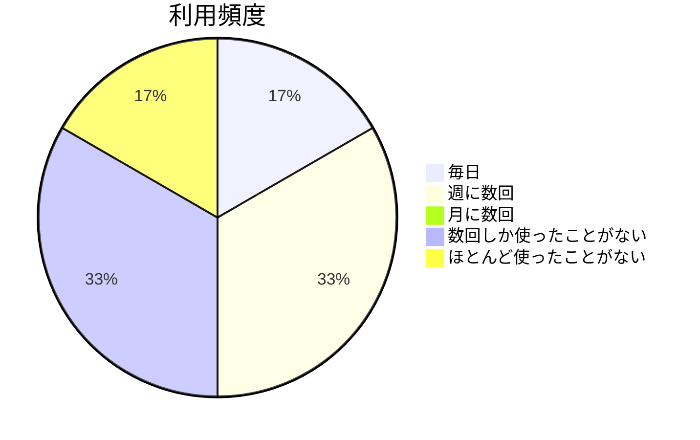
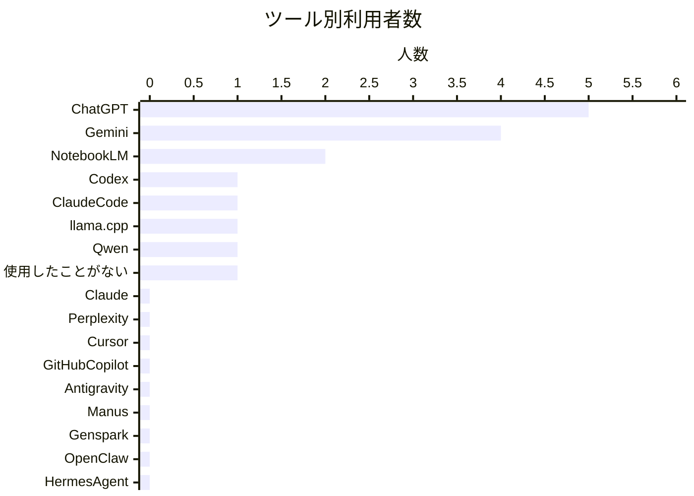
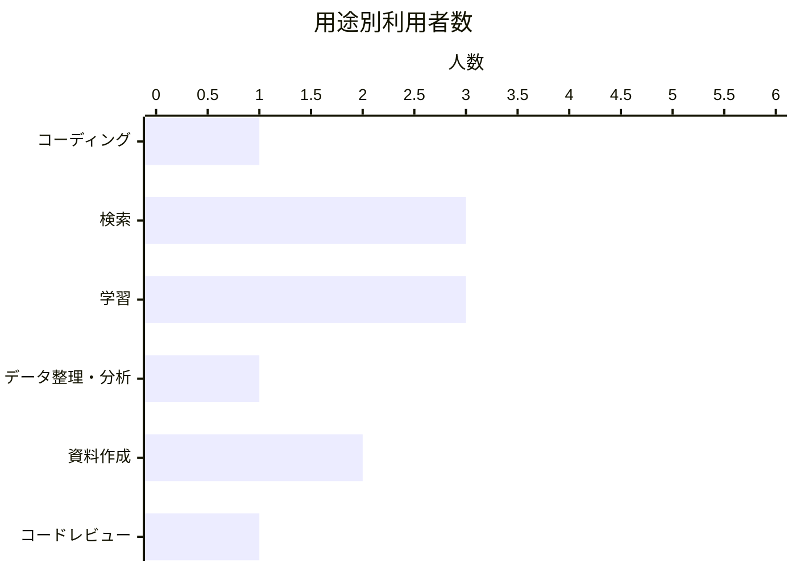
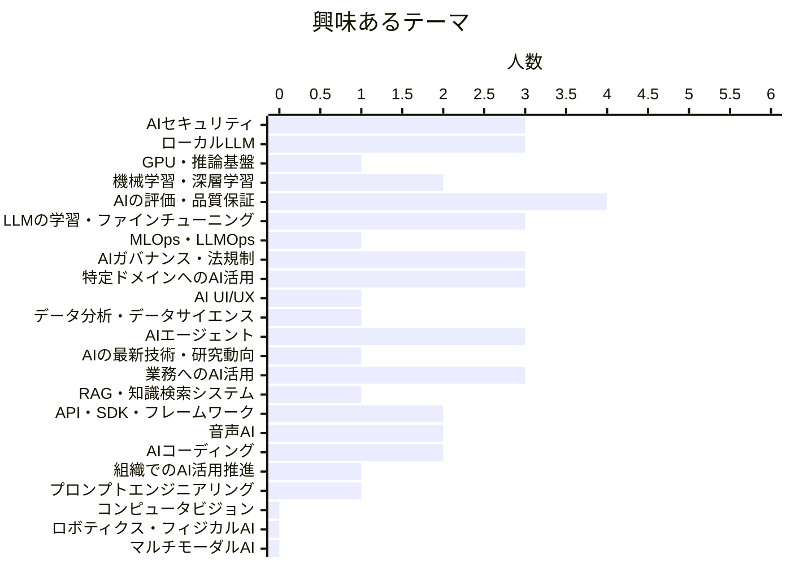
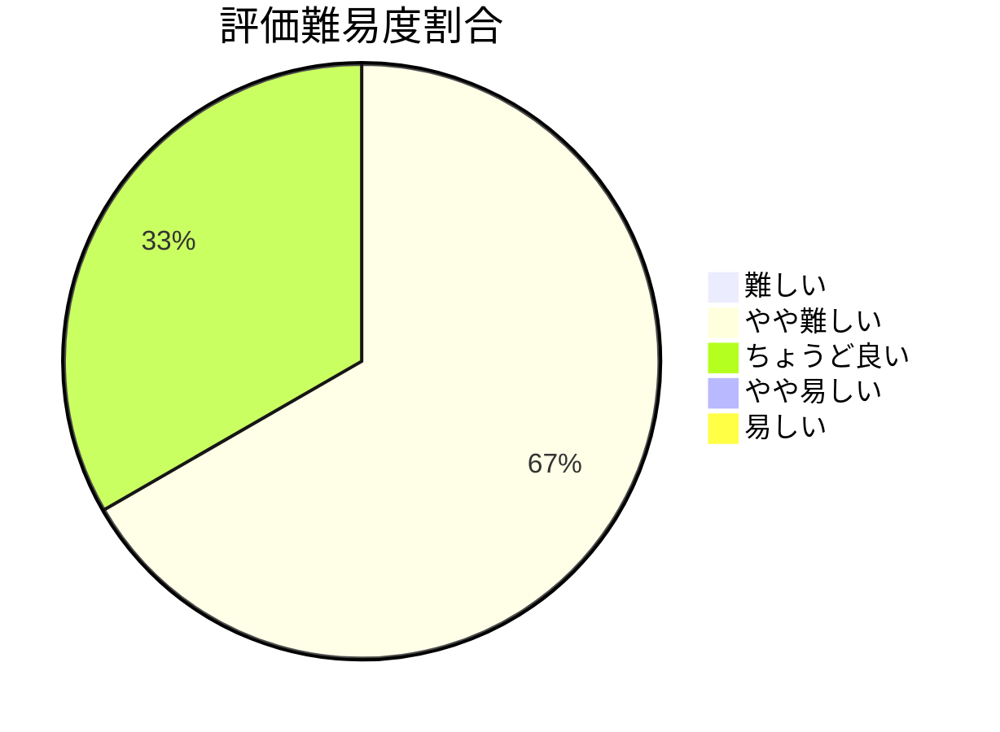
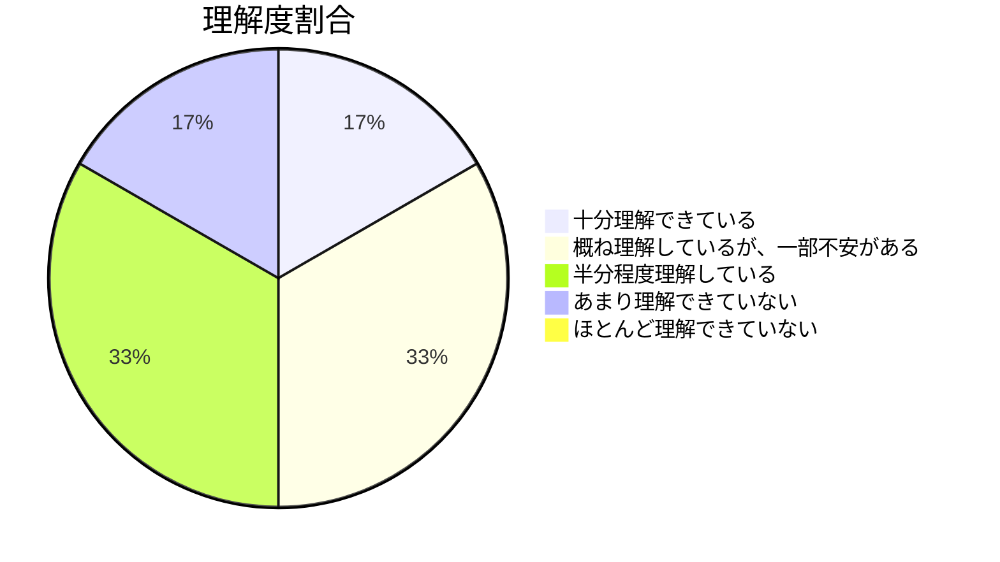

# AI利用状況調査と勉強会に関するアンケート

- 回答期間：2026年8月21日 ～ 8月27日
- 回答者数：6名
- 対象者：Slack`#勉強会`チャンネルメンバー

## 普段、AIをどの程度利用していますか？

週1回以上使う層と、ほとんど使っていない層がそれぞれ3名で二分されており、AI利用の習慣化は道半ば。前提知識のばらつきを想定した進行が必要。

## 普段利用しているツールやサービスを教えてください。

利用はChatGPT（5名）・Gemini（4名）・NotebookLM（2名）に集中し、OpenAIとGoogleの汎用チャットが事実上の標準。利用者5名あたり平均3ツールで、複数併用はしているが選択肢の幅は狭い。

- **AIコーディング・エージェント系は未経験**：Cursor、GitHub Copilot、Manus、Genspark、Antigravityなどがいずれも0名で、経験者はCodexとClaude Codeの各1名のみ。エージェントを扱う際はツールの前提から説明が必要。
- **Anthropic系はチャット経由では未使用**：Claudeが0名で、Claude Code（1名）が唯一の接点。モデルの違いを論じる前に、素のClaudeに触れる機会自体が乏しい。
- **ローカル実行は関心と実績の差が大きい**：llama.cpp・Qwenは各1名で、ローカルLLMに興味を示した3名（後掲）の多くが未着手。

## AIをどのような用途で利用していますか？

検索・学習が各3名で最多、コーディングやコードレビューは各1名。情報収集の補助が主用途で、開発や実務プロセスへの組み込みはまだ限定的。

## 興味あるテーマをすべて選択してください。

1人あたり平均約6.8テーマを選びながら最多は評価・品質保証の4名にとどまり、全員が求める中心テーマは存在しない。関心は広く薄く分散している。

- **リスク・品質面が上位**：評価・品質保証4名、セキュリティ・ガバナンス各3名。一方でAIコーディング2名、プロンプトエンジニアリング・RAG各1名と実践寄りは下位で、実際の利用が試用段階にとどまっている状況（前掲2問）と対照的。使いこなす前に「安心して任せられるか」を知りたいという意識が先行している。
- **自前運用への関心と基盤知識のギャップ**：ローカルLLM・ファインチューニングが各3名と上位なのに、それを支えるGPU・推論基盤とMLOps・LLMOpsは各1名。動かしてみたい意欲に対し、運用コストの認識は薄く、両者を接続する説明が必要。
- **関心はテキスト・LLMに集中**：コンピュータビジョン、ロボティクス・フィジカルAI、マルチモーダルAIはいずれも0名で、音声AI2名が唯一の例外。当面はLLM中心の構成が妥当。

## これまでの勉強会の難易度を評価してください。

「やや難しい」が4名で3分の2を占め、「難しい」と易しい側はいずれも0名。手が届かないほどではないが全体として難易度が上寄りで、内容の水準を下げるより前提知識の補足や復習の機会で差を埋めるのが有効。

## これまでの勉強会に対する理解度を教えてください。

「概ね以上」3名と「半分程度以下」3名で二分し、冒頭のAI利用頻度と同じ3対3の構図が現れている。難易度評価が「やや難しい」に集中していたのに対し理解度は分散しており、難しさの感じ方は共通でも定着度に差が出ている。日常的にAIに触れているかどうかが要因とみられ、講義内で手を動かす時間の確保が鍵。

## 勉強会に対する要望や意見はありますか？

- 講義中心ではなく、質問や意見交換が活発になる進行・運営を検討してほしい。
- 紹介するツールやライブラリについて、類似・代替手段も含めて比較・整理してほしい。
- 録画視聴などで後から学習した際に疑問点が出たら、個別に質問させてほしい。

要望は「進行の双方向化」と「紹介する技術の比較・整理」に集約され、内容量や範囲への不満は挙がっていない。難易度がやや上寄りで理解度が二分している状況とも符合しており、扱うテーマを絞るより、対話の時間と参照しやすい比較情報を増やす方が効果的。3点目は要求ではなく質問意欲の表明なので、随時受け付ける姿勢を示しておけば足りる。

## 全体総括

回答者6名は「週1回以上AIを使う層」と「ほとんど使っていない層」に3対3で分かれ、理解度もまったく同じ比率で二分している。日常的に触れているかどうかが理解の定着を左右しており、単一の難易度設定では両者を同時に満たせない構造がある。利用実態は汎用チャット（ChatGPT・Gemini）による検索・学習が中心で、AIコーディングやエージェント系ツールの経験者はほぼ皆無。にもかかわらず関心は評価・品質保証やセキュリティ・ガバナンスといった信頼性の担保、さらにローカルLLMやファインチューニングのような自前運用へ向いており、手元の経験より一歩先を見ている。つまり「まだ触っていないが、任せられるかどうかを見極めたい」段階にある。難易度は「やや難しい」が3分の2を占めるが「難しい」は0名で、要望も内容量ではなく双方向性と技術の比較・整理に集まった。したがって今後は、テーマの水準を下げるのではなく、LLM・エージェントを軸に据えたまま、前提知識の補足、講義中に手を動かす時間、類似ツールを並べた比較情報、そして質問しやすい進行を組み合わせるのが有効と考えられる。
